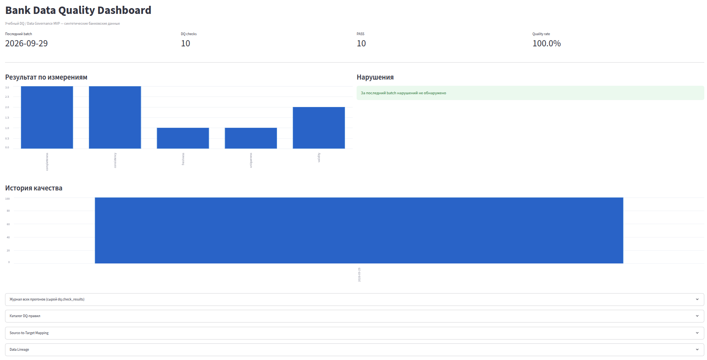
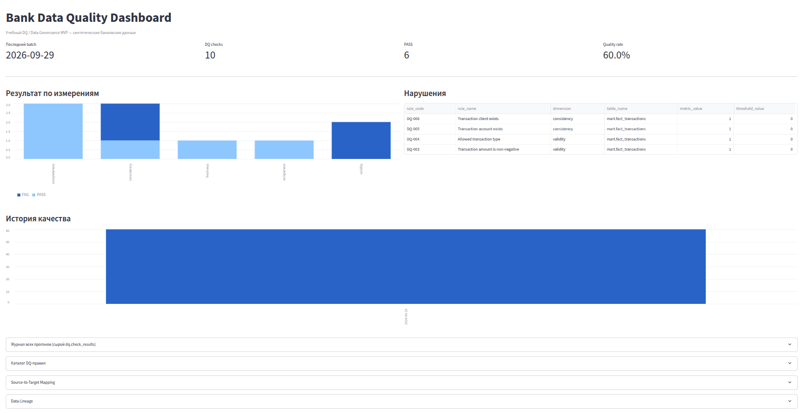
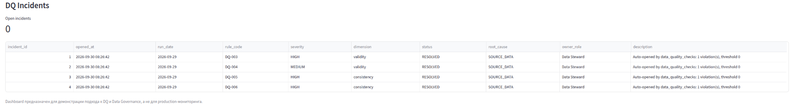
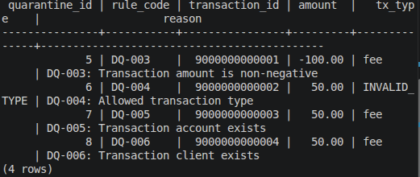

# Bank Data Quality & Data Governance MVP

Учебный pet-project на банковском домене, демонстрирующий практическую реализацию **Data Quality** и элементов **Data Governance** вокруг DWH-контура.

Проект построен на синтетических данных и не имитирует реальный production-контур конкретного банка.

Основной фокус — не разработка DWH как такового, а контроль качества данных, обработка нарушений и управление метаданными:

* Data Quality Rules;
* severity и блокировка pipeline по критичным нарушениям;
* DQ Incidents;
* quarantine проблемных записей;
* Source-to-Target Mapping;
* Data Lineage;
* CDE и PII;
* RBAC;
* DQ Dashboard.

---

## Что реализовано

### Data Quality

Реализован каталог из 10 DQ-правил:

| Код    | Проверка                                         | Dimension    | Severity |
| ------ | ------------------------------------------------ | ------------ | -------- |
| DQ-001 | `client_id` не должен быть NULL                  | Completeness | HIGH     |
| DQ-002 | `transaction_id` должен быть уникальным          | Uniqueness   | HIGH     |
| DQ-003 | `amount` не может быть отрицательным             | Validity     | HIGH     |
| DQ-004 | `tx_type` должен входить в допустимый справочник | Validity     | MEDIUM   |
| DQ-005 | `account_id` должен существовать                 | Consistency  | HIGH     |
| DQ-006 | `client_id` должен существовать                  | Consistency  | HIGH     |
| DQ-007 | клиент счёта должен существовать                 | Consistency  | HIGH     |
| DQ-008 | дата batch должна присутствовать                 | Completeness | HIGH     |
| DQ-009 | timestamp транзакции должен присутствовать       | Completeness | HIGH     |
| DQ-010 | ежедневный batch должен содержать данные         | Freshness    | HIGH     |

Правила хранятся в `dq.rule_catalog` и загружаются DAG динамически.

Результаты проверок сохраняются в:

```text
dq.check_results
```

Для каждого запуска фиксируются:

* правило;
* дата запуска;
* статус PASS / FAIL;
* количество проверенных записей;
* количество нарушений;
* severity.

---

## DQ Incident Management

При нарушении DQ-правила создаётся incident.

Жизненный цикл:

```text
OPEN
  ↓
TRIAGED
  ↓
IN_REMEDIATION
  ↓
RECHECK
  ↓
RESOLVED / ACCEPTED
```

Для incidents предусмотрены:

* код сценария;
* DQ rule;
* severity;
* дата обнаружения;
* статус;
* root cause category;
* описание;
* связь с batch/run;
* повторная проверка после remediation.

Каталог сценариев находится в:

```text
data_governance/dq_incident_catalog.md
```

Сами incidents хранятся в БД.

---

## Quarantine

Для ряда row-level DQ-проверок реализован quarantine-механизм.

Проблемные записи сначала сохраняются в:

```text
dq_incident.quarantine_transactions
```

После этого некорректные строки удаляются из целевой `fact_transactions`.

Quarantine используется, в частности, для:

* отрицательных/NULL amounts;
* недопустимого `tx_type`;
* отсутствующих accounts;
* отсутствующих clients;
* NULL transaction timestamp.

Обработка сделана идемпотентной: одна и та же запись не должна повторно попадать в quarantine для одного incident.

Критические `HIGH`-нарушения приводят к падению DQ-task и блокируют успешное завершение pipeline.

---

## Demo

### Dashboard — успешная проверка



### Dashboard — обнаружение нарушений



### Incidents после обработки



### Quarantine



---

## Архитектура

```text
                    ┌─────────────────┐
                    │  Bank API       │
                    │  Simulator      │
                    └────────┬────────┘
                             │
                             ▼
                    ┌─────────────────┐
                    │    Airflow      │
                    │ extract_raw     │
                    └────────┬────────┘
                             │
                             ▼
                    ┌─────────────────┐
                    │     MinIO       │
                    │   raw layer     │
                    └────────┬────────┘
                             │
                             ▼
                    ┌─────────────────┐
                    │      Spark      │
                    │ transformation  │
                    └────────┬────────┘
                             │
                             ▼
                    ┌─────────────────┐
                    │   PostgreSQL    │
                    │      mart       │
                    └────────┬────────┘
                             │
                             ▼
                    ┌─────────────────┐
                    │   Data Quality  │
                    │      DAG        │
                    └──────┬───┬──────┘
                           │   │
             ┌─────────────┘   └──────────────┐
             ▼                                ▼
      ┌──────────────┐                ┌────────────────┐
      │ DQ Results   │                │   Incidents    │
      │              │                │ + Quarantine   │
      └──────┬───────┘                └────────────────┘
             │
             ▼
      ┌──────────────┐
      │  Streamlit   │
      │  Dashboard   │
      └──────────────┘
```

Полная схема также доступна в:

```text
pictures/pipeline.svg
```

---

## Data Governance

Проект содержит отдельный governance-контур.

### Data Dictionary

Описание сущностей, полей и их назначения:

```text
data_governance/data_dictionary.md
```

### Source-to-Target Mapping

Для полей описаны:

* source;
* source field;
* target;
* target field;
* transformation;
* business rule;
* DQ rule;
* CDE / PII-признак.

Например:

```text
transactions.amount
        ↓
CAST(...)
        ↓
mart.fact_transactions.amount
        ↓
DQ-003
```

S2T хранится не только в документации, но и в таблице:

```text
governance.s2t_mapping
```

### Data Lineage

Зафиксирована цепочка:

```text
Bank API
   ↓
Airflow
   ↓
MinIO / raw
   ↓
Spark
   ↓
PostgreSQL mart
   ↓
DQ
   ↓
DQ Results / Incidents
   ↓
Dashboard
```

Метаданные lineage также представлены в БД:

```text
governance.data_lineage
```

Документ:

```text
data_governance/data_lineage.md
```

---

## CDE и PII

В проекте разделены обычные аналитические данные и ограниченные персональные данные.

### `mart`

Содержит данные, предназначенные для аналитического использования.

Например:

```text
mart.dim_client
mart.dim_account
mart.fact_transactions
```

### `restricted`

Содержит PII:

```text
restricted.dim_client_pii
```

Например:

* `full_name`;
* `birth_date`.

В аналитическом слое имя клиента представлено в обезличенном виде.

---

## RBAC

Созданы отдельные роли:

```text
analyst_ro
data_steward
```

`analyst_ro` имеет доступ к аналитическому слою `mart`, но не к `restricted`.

`data_steward` имеет доступ к restricted-данным.

Таким образом, в MVP продемонстрирован базовый принцип разделения:

```text
Analytical Data
      ≠
Restricted / PII Data
```

---

## DQ Dashboard

Streamlit Dashboard показывает:

* последний batch;
* количество DQ-проверок;
* PASS / FAIL;
* Quality Rate;
* качество по dimensions;
* violations;
* историю запусков;
* каталог правил;
* incidents;
* S2T;
* lineage.

Dashboard предназначен прежде всего для демонстрации DQ-контура и анализа результатов проверок.

---

## Pipeline

В проекте используются три основных Airflow DAG:

```text
extract_raw_dag.py
        ↓
transform_load_mart_dag.py
        ↓
data_quality_dag.py
```

DQ DAG запускается после завершения загрузки mart и выполняет проверки качества данных.

Для взаимодействия с Spark используется Spark connection:

```text
spark://spark-master:7077
```

---

## Технологический стек

| Технология     | Назначение                     |
| -------------- | ------------------------------ |
| Python         | ETL/DQ logic                   |
| SQL            | DQ checks, metadata, incidents |
| PostgreSQL     | DWH mart, metadata, incidents  |
| Apache Airflow | orchestration                  |
| Apache Spark   | transformation                 |
| MinIO          | object storage / raw layer     |
| Streamlit      | DQ Dashboard                   |
| Docker Compose | запуск окружения               |
| Git            | version control                |

---

## Структура проекта

```text
bank-dwh-mvp/
│
├── api_simulator/
│   ├── app.py
│   └── Dockerfile
│
├── airflow/
│   ├── dags/
│   │   ├── extract_raw_dag.py
│   │   ├── transform_load_mart_dag.py
│   │   └── data_quality_dag.py
│   └── Dockerfile
│
├── dashboard/
│   ├── app.py
│   └── Dockerfile
│
├── data_governance/
│   ├── data_dictionary.md
│   ├── dq_rule_catalog.md
│   ├── dq_incident_catalog.md
│   ├── dq_dashboard.md
│   ├── dq_incident_dashboard_queries.sql
│   ├── source_to_target_mapping.md
│   └── data_lineage.md
│
├── docs/
│   ├── 01-dashboard-pass.png
│   ├── 02-dashboard-fail.png
│   ├── 03-incidents-resolved.png
│   └── 03-quarantine.png
│
├── mart/
│   └── init.sql
│
├── scripts/
│   ├── cleanup_bad_data.sql
│   └── inject_bad_data.sql
│
├── spark/
│   └── jobs/
│       └── transform.py
│
├── pictures/
│   └── pipeline.svg
│
├── docker-compose.yml
├── .env.example
├── DOCKER_RUN.md
└── README.md
```

---

## Быстрый запуск

### 1. Clone

```bash
git clone https://github.com/inashahalov/bank-dwh-mvp.git
cd bank-dwh-mvp
```

### 2. Запуск

```bash
docker compose up -d --build
```

### 3. Проверка контейнеров

```bash
docker compose ps
```

После запуска доступны Airflow, Streamlit Dashboard, MinIO и PostgreSQL.

Подробная инструкция:

```text
DOCKER_RUN.md
```

---

## Демонстрация DQ-нарушения

Для демонстрации можно использовать подготовленные SQL-скрипты:

```text
scripts/inject_bad_data.sql
scripts/cleanup_bad_data.sql
```

Сценарий:

```text
1. Inject bad data
        ↓
2. Airflow DQ check
        ↓
3. FAIL
        ↓
4. Incident OPEN
        ↓
5. Quarantine
        ↓
6. Remove invalid records
        ↓
7. Recheck
        ↓
8. RESOLVED
```

Это позволяет воспроизводимо показать полный жизненный цикл DQ-инцидента.

---

## Ограничения проекта

Это **учебный MVP**, а не production implementation.

В частности:

* источники данных синтетические;
* нет реального банковского production data;
* lineage поддерживается вручную через metadata;
* нет enterprise catalog вроде Collibra / Apache Atlas / DataHub;
* RBAC реализован на уровне PostgreSQL;
* DQ rules не являются частью корпоративной платформы Data Governance;
* нет промышленной системы уведомлений;
* нет интеграции с реальным incident-management сервисом;
* проект не заявляет production-опыт с конкретными банками.

Цель проекта — показать **понимание принципов и способность собрать работающий end-to-end DQ/Governance контур**.

---

## Что демонстрирует проект

Проект позволяет показать на практике следующие компетенции:

### Data Quality

* completeness;
* uniqueness;
* validity;
* consistency;
* freshness;
* severity;
* DQ rule catalog;
* quality metrics;
* quarantine.

### Data Governance

* Data Dictionary;
* CDE;
* PII;
* RBAC;
* Source-to-Target Mapping;
* Data Lineage;
* metadata management.

### Incident Management

* incident creation;
* severity;
* root cause classification;
* lifecycle;
* remediation;
* recheck;
* resolution.

### Data Engineering

* Airflow orchestration;
* Spark transformation;
* object storage;
* PostgreSQL;
* Docker Compose;
* SQL/Python automation.

---

## Позиционирование проекта

Проект создан как демонстрационный кейс для ролей:

* **Data Quality Engineer**
* **Data Steward**
* **Data Governance / Data Quality Analyst**
* **DWH / Data Systems Analyst**

При этом проект не заменяет коммерческий опыт и не представляет учебную реализацию как production experience.

---

## Автор

**Илья Нашахалов**

IT / Banking / Data Quality / DWH / Data Governance 

GitHub: [inashahalov / bank-dwh-mvp](https://github.com/inashahalov/bank-dwh-mvp?utm_source=chatgpt.com)
